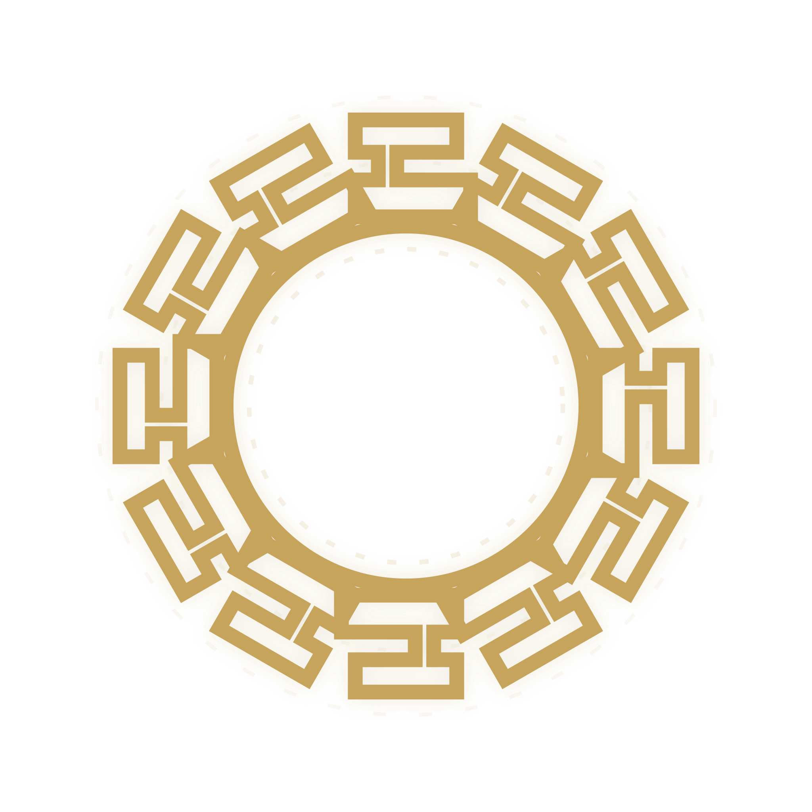

<!-- Idioma: [English](README.md) · **Português** -->
<p align="center">
  
</p>

# Talos

Plugin **Talos** v0.20.0 — pipeline determinístico (contrato §7 → plano → execução → validação) com skills `talos-*`, templates e MCP. Um pacote, nove hosts: **Claude Code**, **Cursor**, **Codex App**, **Antigravity (Gemini)**, **ZCode**, **OpenCode**, **Pi CLI**, **VS Code** e **MinimaxCode**.

**Versão:** [`VERSION`](VERSION) (`0.20.0`) · **Repo:** https://github.com/pauloborini/talos

## Hosts

| Host | Instalação (recomendada) | Artefato release | Deps obrigatórias |
|------|--------------------------|------------------|-------------------|
| Claude Code | Marketplace GitHub | `talos-claude.plugin` | — |
| Cursor | **Igual ao Claude Code** (ver nota abaixo) | `talos-claude.plugin` | — |
| Codex App | Marketplace GitHub | `talos-codex.plugin` | — |
| Antigravity (Gemini) | Instalador from-source (`init antigravity`) → `~/.gemini/config/` | — (cópia direta, sem artefato `.plugin`) | — |
| ZCode | Instalador cache-based (`init zcode`) → `~/.zcode/cli/plugins/cache/` | `talos-zcode.plugin` | — |
| Opencode | Catálogo from-source `hosts/opencode/` | `talos-opencode.plugin` | — |
| Pi CLI | Catálogo from-source `hosts/pi/` | `talos-pi.plugin` | **`pi-mcp-adapter` + `pi-subagents`** |
| VS Code | Instalador from-source (`init vscode`) → `~/.vscode-talos/` (global) ou `.vscode/` (projeto) | `talos-vscode.plugin` | — |
| MinimaxCode | Instalador from-source (`init minimaxcode`) → `~/.minimax/plugins/talos/` (Plugin V1; já global) | — (cópia direta do Plugin V1, sem artefato `.plugin`) | — |

**Cursor:** não há pacote nem marketplace próprios — o plugin instalado via `claude plugin` no escopo do usuário já vale para o Cursor (mesmo manifest `.claude-plugin/`). Limitação de packaging, não do pipeline.

**ZCode:** subagentes de plugin (`subagent_type: "talos-*"`) não herdam conexões MCP do processo pai — bug do host, não do Talos. O adapter zcode contorna isso com fallback automático: o orquestrador despacha `general-purpose` (nativo, herda MCP) lendo `agents/<name>.md` como system prompt. O isolamento sibling (Gate G4) é preservado — ainda é subagente irmão isolado.

**Conceito:** todos são *hosts* (onde as skills rodam). O pipeline é o mesmo; diferenças nativas (subagente, todo, MCP, dispatch do validador frio) vivem em [`host-adapters.md`](packages/orchestrator/references/host-adapters.md) e na tool `talos_capabilities` (contrato `schema_version: 5` — `validator_dispatch` declara `dispatcher` + `join` por host; ver [Topologia do validador frio (G4)](#topologia-do-validador-frio-g4)). Host sem subagente+MCP é **rejeitado no preflight** (gate `PREREQ`, hard-fail); host sem join síncrono do validador é **rejeitado no preflight** (gate `JOIN`, hard-fail) — determinismo > alcance.

**Pré-requisito:** Node.js no host. Após instalar, confirme o MCP com `talos_ping`.

## Instalação rápida (1 comando, via npx)

> Referência rápida de todos os comandos (instalar/atualizar/remover por host): **[COMMANDS.pt-BR.md](COMMANDS.pt-BR.md)**.

Um instalador único cobre os hosts de forma **global** (recomendado para valer em todos os projetos) — não precisa clonar o repo:

```bash
npx github:pauloborini/talos init claudecode   # ou: cursor
npx github:pauloborini/talos init codex
npx github:pauloborini/talos init antigravity
npx github:pauloborini/talos init zcode
npx github:pauloborini/talos init opencode --global
npx github:pauloborini/talos init pi --global --yes  # --yes auto-instala as 2 deps
npx github:pauloborini/talos init vscode               # projeto atual
npx github:pauloborini/talos init vscode --global       # todos os projetos
npx github:pauloborini/talos init minimaxcode           # Plugin V1 em ~/.minimax/plugins/talos/ (aliases: mavis | minimax-code | mmc)
```

- **claudecode/cursor**: o instalador roda o `marketplace add` + `install` nativos da CLI por você. Já são globais por natureza.
- **codex**: o instalador roda `marketplace add` + `plugin add` e também copia os custom agents Talos para `CODEX_HOME/agents` (`~/.codex/agents` se `CODEX_HOME` não estiver definido). Este é o caminho garantido para `spawn_agent(agent_type: "talos-*")`.
- **antigravity**: o instalador registra o Talos como um plugin em `~/.gemini/config/plugins/` e adiciona o MCP correspondente em `mcp_config.json`.
- **zcode**: o instalador copia o catálogo from-source `hosts/zcode/` para `~/.zcode/cli/plugins/cache/zcode-plugins-official/talos/<version>/`, atualiza o `marketplace.json` cache e habilita o plugin em `~/.zcode/cli/config.json` (`enabledPlugins`). ZCode é Claude Agent SDK (clone estrutural do Claude Code): `Agent(subagent_type)` + `TodoWrite` + MCP stdio nativos — perfil `self_evident`, sem dependências externas.
- **opencode**: com `--global`, instala globalmente em `~/.config/opencode/` (o MCP é registrado com caminho absoluto, funcionando em todos os projetos).
- **pi**: com `--global`, instala globalmente em `~/.pi/agent/` (honra `PI_CODING_AGENT_DIR`), registra o MCP em `mcp.json` global e checa/instala as deps `pi-mcp-adapter` + `pi-subagents`.
- **vscode**: com `--global`, instala o runtime em `~/.vscode-talos/`, copia agentes e skills para o prompt folder do VS Code (`~/Library/Application Support/Code/User/prompts/` no macOS) e registra o MCP no `settings.json` do usuário (`github.copilot.chat.mcpServers`). Sem `--global`, instala no projeto atual (`.vscode/talos/` + `.vscode/mcp.json`). VS Code Copilot Chat é o host nativo com `runSubagent` + `manage_todo_list` + MCP — perfil `self_evident`, sem dependências externas.
- **minimaxcode**: instala o Plugin V1 do Talos em `~/.minimax/plugins/talos/` (estrutura: `.minimax-plugin/plugin.json` + `icon.png` + `server.js` empacotado + `skills/talos-*/SKILL.md` + `servers/mcp.json` com `args: ["./server.js"]` relativo). O MCP `talos` é auto-descoberto pelo MinimaxCode a partir do `servers/mcp.json` do plugin (sem registro manual no DB do Mavis). Cria também 5 custom agents em `~/.minimax/agents/talos-*/` (um por `agents/talos-*.md` do Talos) — formato MinimaxCode: `agent.md` (system_prompt puro) + `config.yaml` (`defaultWorkspaceDir`). O `install-host.sh mavis` faz o mesmo em bash; o `npx init minimaxcode` é o caminho oficial. Honra `MINIMAX_DATA_DIR` para override.

No modo `--global` o runtime vai para um local estável (`~/.config/opencode/talos` ou `~/.pi/agent/talos`) e o MCP é registrado com **caminho absoluto** (sem depender do cwd). opencode: agente em `~/.config/opencode/agents/`, skills em `~/.config/opencode/skills/`. pi: agente em `~/.agents/` (se existir) ou `~/.pi/agent/agents/`, MCP em `~/.pi/agent/mcp.json`. A config existente é **mesclada** (preserva outros MCP servers e chaves); se houver `opencode.jsonc` com comentários, ele é preservado e o Talos é registrado no fallback `opencode.json`.

### Instalação por-projeto (opcional / escopo restrito)

Caso prefira limitar a instalação de `opencode` ou `pi` a apenas um projeto específico, execute omitindo a flag `--global`:

```bash
npx github:pauloborini/talos init opencode      # no diretório do projeto (.opencode/ + opencode.json)
npx github:pauloborini/talos init pi --yes      # no diretório do projeto (.mcp.json + .pi/)
```

Neste caso, os caminhos serão salvos de forma relativa, exigindo que você execute a CLI a partir do diretório raiz onde o Talos foi inicializado.

Flags úteis: `--global`/`-g` (opencode/pi), `--dir <d>` (alvo por-projeto), `--yes` (auto-deps pi), `--dry-run` (mostra sem alterar), `-h`.

> **Plataformas:** macOS e Linux são suportados (mesmo caminho POSIX). Windows tem suporte por código (spawn das CLIs via shell; root global do opencode em `%APPDATA%\opencode`, ou `XDG_CONFIG_HOME` se definido; pi em `%USERPROFILE%\.pi\agent`) — smoke real do runtime MCP parcialmente validado no Windows; smoke do instalador automatizado (`build/smoke-install.mjs`) roda em Unix. No Windows, defina `XDG_CONFIG_HOME` para forçar o caminho do opencode de forma determinística.
## Instalação manual (alternativa)

Se preferir não usar o `npx` ou necessitar de instalação offline, você pode utilizar os comandos manuais oficiais dos gerenciadores de pacotes nativos de cada host.

### Claude Code e Cursor

```bash
claude plugin marketplace add pauloborini/talos
claude plugin install talos@talos
```

### Codex App

```bash
npx github:pauloborini/talos init codex
```

Evite instalar Codex só com `codex plugin add`: o plugin expõe skills/MCP, mas custom agents podem não ser registrados como `agent_type` pelo host. O `init codex` instala ambos.

> Para instruções de instalação manual e de baixo nível em hosts como **opencode** e **pi cli**, consulte o **[COMMANDS.pt-BR.md](COMMANDS.pt-BR.md)**.

### Desinstalar

O desinstalador via `npx` remove apenas os artefatos e agentes do Talos, preservando as configurações e skills locais do usuário.

Se a instalação foi **global** (padrão recomendado):
```bash
npx github:pauloborini/talos uninstall claudecode   # ou: cursor
npx github:pauloborini/talos uninstall codex
npx github:pauloborini/talos uninstall antigravity
npx github:pauloborini/talos uninstall zcode
npx github:pauloborini/talos uninstall opencode --global
npx github:pauloborini/talos uninstall pi --global
npx github:pauloborini/talos uninstall vscode --global
npx github:pauloborini/talos uninstall minimaxcode
```

Se a instalação foi local **por-projeto**:
```bash
npx github:pauloborini/talos uninstall opencode
npx github:pauloborini/talos uninstall pi
```

> Para realizar a desinstalação manual (nativa de cada CLI) ou para entender os diretórios afetados, consulte o **[COMMANDS.pt-BR.md](COMMANDS.pt-BR.md)**.

## Artefato `.plugin` (opcional)

Alternativa à instalação via GitHub: baixar o `.plugin` do host (`claude`, `codex`, `opencode`, `pi`, `zcode` ou `vscode`) na [release](https://github.com/pauloborini/talos/releases) (tags `v*`), validar com `shasum -a 256 -c SHA256SUMS` e instalar pelo fluxo do host. Cursor usa o artefato Claude.

## Como usar

Comando (Claude Code / Cursor): `/talos <mode> <input-type> [input] [flags]`

No Codex, Antigravity, opencode, pi, zcode, VS Code e MinimaxCode, invoque a skill do orquestrador com o mesmo padrão de argumentos (ex.: `/talos full sprint S05`). O verbo de dispatch do subagente é resolvido por `talos_capabilities` (host-agnóstico).

Se você quiser começar fora do fluxo principal, as skills listadas abaixo são os atalhos explícitos para backlog, contrato §7 (entrevista), auditoria, plano, execução e revisão.

### Modos

| Modo | Quando usar | O que faz |
|------|-------------|-----------|
| **`full`** | Sprint/backlog novo ou feature do zero | Matura contrato §7 no sprint file (entrevista se preciso) → **plano** (`.talos/plans/`) → **executa** o plano → review (opcional ou obrigatória via `critical_review`) |
| **`direct`** | Contrato §7 já aprovado+selo | Valida sprint/§7 → entrevista só se houver gap → **executa direto** (sem fase de plan handoff) → review (opcional ou obrigatória via `critical_review`) |
| **`execute`** | Já tenho um `PLAN_*.md` pronto | Reverifica o plano (artefato + conformidade) → **executa o plano existente** → review (opcional ou obrigatória). **Não regera plano.** Único modo que aceita plano `Source mode: standalone` (sem sprint) — `full`/`direct` exigem sprint na entrada e rejeitam esse plano. |
| `interview-only` | Só fechar decisões / brainstorm | Entrevista o contrato §7; não implementa |
| **`audit`** | Quero diagnóstico sem patch | Audita target/boundary contra regras locais + stack detectada + Ponytail pass; `--handoff` grava `.talos/plans/PLAN_AUDIT_*.md` sem executar |

**Dica:** `full` = “quero contrato §7 + plano + código”. `direct` = “já tenho §7 aprovado, implementa”. `execute` = “já tenho o plano, só executa”. `audit` = “diagnostica, não corrige”.

> **Roteamento por tipo de input (v0.4.1+):** o tipo do arquivo que você passa **prevalece** sobre o modo digitado. Apontar um `PLAN_*.md` em `direct`/`full` (mesmo renomeado) auto-roteia para `execute` com um aviso de uma linha — nunca gera “plano de plano”. Pedir `execute` sobre um backlog/sprint roteia de volta para `full`/`direct`.

### Input types

- `sprint` — ID de sprint já ancorado no backlog e em sprint file vivo (ex.: `S05`)
- `backlog-item` — alias legado de `sprint`
- `idea` — indicação curta em texto
- `plan` — caminho para `PLAN_*.md` existente (principal em **`execute`**)
- `target` — arquivo/diretório/feature/módulo auditável (só em **`audit`**)
- `brainstorm` — texto livre (só com `interview-only`)

### Flags

- `--review` — roda `talos-slice-review` no final (senão opcional). Se o sprint declara `policy_manifest.critical_review.required: true` no §10, a review é **obrigatória** mesmo sem a flag (Gate G8)
- `--loop` — esteira serial de sprints com auto-correção: em toda seleção passa `loop:true` ao MCP e pode maturar primeiro uma sprint `backlog` válida, com deps satisfeitas e DoR amarelo/verde, pela entrevista do §7; depois a reseleciona antes de plano/execução. Corrige residual de review in-loop (repair → verification), despacha o sidecar `talos-escalation-repair` se o residual persistir, estaciona sprint irrecuperável em `detached_repair` e drena `PENDENCIAS_<slug>.md` sob demanda; implica review crítica (G8) sem editar `policy_manifest` por sprint. Sem a flag, o pipeline atual não muda
- `--interview` — força entrevista do contrato §7 mesmo sem ambiguidades detectadas
- `--handoff` — só em **`audit`**: grava `.talos/plans/PLAN_AUDIT_*.md` TC-conforme sem executar correção
- `--scope <descrição>` — só em **`audit`**: restringe o boundary textual da auditoria
- `--help` — sintaxe completa

### Exemplos

Feature nova a partir do sprint (pipeline completo):

```
/talos full sprint "S05"
```

Sprint já recortada; implementar direto sem gerar plano separado:

```
/talos direct sprint "S05"
```

Mesmo sprint, com review fria da slice no final:

```
/talos direct sprint "S05" --review
```

Ideia solta (cria/atualiza backlog + sprint file, matura §7 e segue o fluxo completo):

```
/talos full idea "cache de sessão com TTL configurável"
```

Plano já escrito; executar direto sem regerar (modo `execute`):

```
/talos execute plan "./.talos/plans/PLAN_S05_login.md"
```

Só alinhar decisões antes de planejar:

```
/talos interview-only brainstorm "dark mode só no web ou mobile também?"
```

Sprint standalone (sem backlog mestre) até execução, sem passar por `full`/`direct`:

```
/talos interview-only brainstorm "ideia direto de conversa"
→ matura o sprint file; Backlog mestre fica "Não aplicável (standalone)"

talos-plan-handoff (uso direto, fora do /talos)
→ lê o contrato §7, detecta source_mode: standalone, escreve PLAN_*.md com Source mode: standalone

/talos execute plan "./.talos/plans/PLAN_<ID>_<slug>.md"
→ único modo que aceita plano standalone; full/direct exigem sprint e rejeitam esse plano na entrada
```

### Dicas práticas

1. Confirme o MCP antes de começar (`talos_ping`); sem MCP o orquestrador para no pré-flight.
2. Artefatos ficam no projeto consumidor: planos em `.talos/plans/`, estado em `.talos/state/<run_id>/`, validação manual em `.talos/manual-validation/`, ledger de rastreabilidade opt-in em `.talos/traceability/`.
3. Em `full`, não espere código antes do `PLAN_*.md` validado — é gate explícito.
4. Ambiguidades no contrato §7 disparam entrevista automaticamente; use `--interview` se quiser forçar.
5. Toda execução passa pelo validador frio (`talos-task-validator`) antes de declarar a slice pronta.
6. **v0.16+:** backlog/sprint sem a coluna `Origem` na §7.1, AC sem `origin` ou §4 sem `Discussão` são rejeitados — inicie artefatos no padrão atual (ver [Procedência 0.16](#procedência-016-e-revisão-fria-do-backlog)).

### Princípio Fire-and-Continue

O pipeline avança fase a fase **sem pedir permissão**. As únicas paradas são gates duros (`blocked`) ou bloqueios reais de ambiente. Decisões em aberto no contrato §7 geram entrevista automática e o fluxo **continua** — o orquestrador não para para pedir confirmação (não há menu “adiar / marcar TBD”). Isso vale para todos os modos e hosts.

### Aceite 0.15 e validação manual

A partir de **v0.15.0** (BREAKING — D19: artefatos pré-0.15 não são suportados; inicie backlog/sprint novo):

| Conceito | O que é |
|----------|---------|
| **`AC-*`** | Aceite atômico no §7.3 (YAML `acceptance`); hierarquia AC⊃EVAL; selo §7 write-once. Checkbox dos 4 grupos foi removido. |
| **`done`** | Só quando todos os `AC-*` estão `proved` no state (`acceptance_results`, schema v3) e não há `M` aberto. Emite `HANDOFF_*.md`. |
| **`manual_validation_pending`** | Prova automática ok, mas há smoke humano (`M`) pendente. **Satisfaz DEP** (dependentes podem rodar). **Não** emite handoff. |
| **Relatório M** | `.talos/manual-validation/<backlog-slug>.md` (IDs `MV-<sprint>-<ac>`). Template: `MANUAL_VALIDATION_REPORT_TEMPLATE.md`. |
| **`talos_sync_manual_validation`** | Sync humano → state/sprint: `validated`/`waived` (com justificativa) → promove `done` + handoff; `failed` bloqueia a origem e liga `revalidation_required` no cone de dependentes. |
| **`revalidation_required`** | Flag (coluna *Revalidação* no backlog), não é status. Bloqueia `done` na origem até revalidar; o select de próxima sprint **não** filtra por ela. |
| **`critical_review`** | `policy_manifest.critical_review.required: true` no §10 → `talos-slice-review` obrigatória antes de fechar status (mesmo sem `--review`). |

Fluxo típico com smoke manual:

```text
validator pass → status manual_validation_pending
→ humano preenche MV-* no relatório
→ talos_sync_manual_validation
→ done + HANDOFF_*.md
→ (opcional) $talos-memory-promote <handoff_path>
```

State de execução exige **`state_schema_version: 3`** (v1/v2 hard-fail). Detalhe de contrato: [`CHANGELOG.md`](CHANGELOG.md) 0.15.0 e [`packages/templates/`](packages/templates/).

### Procedência 0.16 e revisão fria do backlog

A partir de **v0.20.0** (BREAKING — corte seco: artefatos pré-0.16 não são suportados; inicie backlog/sprint novo):

| Conceito | O que é |
|----------|---------|
| **`Origem`** | Coluna obrigatória na §7.1 do sprint file (`\| ID \| Decisão \| Origem \|`) e nas decisões do backlog; enum `usuario` \| `derivado:<path>` \| `premissa`. |
| **`origin`** | Campo obrigatório em cada `AC-*` do §7.3 com o mesmo enum; ausência é recusa de schema. |
| **`premissa`** | Não sustenta aceite de sprint `Must`/`P0` — o gate `talos_verify_sprint_file` bloqueia nomeando o `AC-*` e a linha. |
| **`derivado:<path>`** | Resolvido contra o disco no root do consumidor; path inexistente recusa sprint/backlog. |
| **§4 `Discussão`** | Obrigatória (sempre) — a fonte de intenção que o revisor frio usa como oráculo. |
| **Entrevista estruturada** | O `talos-backlog-generator` escaneia o rascunho em memória (`talos_scan_acceptance` com `sprint_markdown`) e roda rodadas de múltipla escolha via `question_prompt`; cada resposta vira decisão `Origem: usuario`. |
| **Revisão fria** | Passo final da skill: lê o mandato de `references/COLD_BACKLOG_REVIEW_PROMPT.md`, despacha um subagente genérico por `subagent_dispatch` (foreground, incondicional), que audita contra a §4, o código e as regras locais, corrige os artefatos e devolve o relatório; gates reexecutados sobre o que mudou. |

Fluxo de uma geração de backlog em `0.16`:

```text
brainstorm → scan do rascunho em memória → rodadas de entrevista (Origem: usuario)
→ escrita + gates (verify_backlog_index / verify_sprint_file / select_next_sprint)
→ revisão fria em contexto novo → regate dos artefatos corrigidos → relatório ao chamador
```

Nenhuma tool MCP nova, nenhum gate novo de orquestrador e nenhum selo de revisão entraram neste release. Schema MCP v5 e topologia sibling/G4/dispatch intactos.

### Rastreabilidade v1 (opt-in) — `talos_traceability`

Disponível a partir da **v0.20.0** (aditiva, opt-in por sprint; sprints legacy intocadas — schema MCP v5 e disco v3 inalterados). Uma sprint entra no modo `traceability v1` com o metadado `Traceability: v1` no sprint file; aí cada requisito (`REQ-*`) é registrado no ledger `.talos/traceability/<backlog-slug>.json` pela tool única `talos_traceability` (actions `upsert`, `verify`, `receipt`, `record_metric`), e cada `AC-*` pode declarar `source_refs` apontando para seus requisitos.

| Conceito | O que é |
|----------|---------|
| **Ledger** | `.talos/traceability/<backlog-slug>.json` — REQs com `sources[]`/`disposition` (`external` exige `ref`; `deferred`/`rejected` com motivo; `deferred` com destino tipado). Escrita absoluta tmp+rename, sem hook, sem coluna nova no backlog. |
| **`source_refs`** | Campo opcional no YAML de cada `AC-*` do §7.3 ligando o critério aos REQs; o conformance valida o grafo REQ↔AC (refs válidas, sem órfãs, REQ `included` com caminho até AC, N:N com motivo). |
| **Gate de fechamento** | `talos_update_sprint_status(done)` em sprint v1 recusa REQ `included` com qualquer AC ligado `unproved` — antes de qualquer write; marcadores inconsistentes nos dois sentidos (sprint marcada sem ledger / ledger marcado sem sprint) bloqueiam com `alinhar_marcadores_traceability`. |
| **Receipt** | Action `receipt` devolve a projeção read-only de fechamento: cobertura por REQ, exceções (`deferred`/`rejected`) e blockers, com escopo da sprint atribuída; o orquestrador só ecoa o payload — não reclama cobertura própria. |
| **Métricas de piloto** | Action `record_metric` persiste `{calls, retries, turns, coverage, instructions}` no documento; economia só se promove com medição registrada. |

Fluxo de fechamento em sprint v1:

```text
REQs via talos_traceability upsert → source_refs nos AC-* do §7.3
→ talos_traceability verify (grafo REQ↔AC)
→ execução → acceptance_results v3 (ACs proved)
→ talos_update_sprint_status done (gate: included ⇒ ACs proved)
→ talos_traceability receipt (projeção de fechamento ecoada pelo orquestrador)
```


### Backlog em 2 camadas

O Talos estrutura a demanda em duas camadas complementares:

- **Backlog mestre** (`BACKLOG_MESTRE_*.md`): índice estratégico enxuto com fases, tabela de sprints, dependências, priorização MoSCoW, coluna *Revalidação* e links para sprint files. É o mapa do produto.
- **Sprint files**: arquivos vivos dedicados por sprint — a fonte de verdade contextual (escopo + **contrato de produto §7** com `AC-*`) que o pipeline lê para entrevistar, planejar e executar slices. Cada sprint file respeita o template canônico e é validado pelo gate `SPRINT_FILE`.

Gates MCP dedicados (`talos_verify_backlog_index`, `talos_verify_sprint_file`, `talos_select_next_sprint`, `talos_update_sprint_status`, `talos_sync_manual_validation`) garantem consistência entre as duas camadas. O gate `DEP` exige que cada dependência esteja `done` **ou** `manual_validation_pending`. Após `talos_select_next_sprint`, `next_action` deriva do estado: §7 draft → `sprint_interview`; §7 aprovado+selo sem PLAN → `plan_handoff` (em `full`); PLAN pronto → `plan_execute` (`direct` nunca sugere `plan_handoff`).

### Skills da cadeia

Cadeia automática de execução: `talos-sprint-interview` → `talos-plan-handoff` → `talos-plan-execute` (full) ou `talos-direct-execute` (direct) → `talos-task-validator` → `talos-findings-repair` (só após `fail`, em qualquer host) → `talos-slice-review` (com `--review` ou quando `critical_review.required:true`)

Residual da review — auto-correção (v0.20.0): P0/P1 na review abre repair com origem `slice_review` (budget 1 por provenance) → **verification pontual** (delta do `repair_evidence`; executa os checks declarados antes de julgar) → sidecar `talos-escalation-repair` (origem `escalation`) se o residual persistir; P2/P3 vira entrada `PD-<sprint>-<NN>` em `PENDENCIAS_<slug>.md` (writer exclusivo do MCP), drenada sob demanda. Sprint com residual irrecuperável no `--loop` estaciona em `detached_repair` (não satisfaz DEP); nunca há 2º validator nem nova review completa no ramo da review.

Modo sem execução: `talos-audit` roda no fio principal, não altera código, não chama executor e pode gravar handoff Talos-style em `.talos/plans/` com `--handoff`.

No modo `full`, as etapas documentais (maturar §7, entrevista, `PLAN_*.md`) ficam no agente principal/orquestrador. O primeiro sub-agent obrigatório nasce só na fase de execução (`talos-plan-execute`).

### Skills com uso direto

Além da cadeia automática, estas skills também podem ser chamadas diretamente para tarefas específicas. Algumas delas aparecem no fluxo principal em outro contexto, mas vale saber quando usar cada uma:

- `talos-backlog-generator` — cria `BACKLOG_MESTRE_*.md` + sprint files a partir de uma conversa, briefing, roadmap ou lista solta de requisitos. Use quando o objetivo for organizar demanda antes de maturarmos o contrato §7.
- `talos-sprint-interview` — valida e amadurece o contrato §7 do sprint file; ao aprovar, grava selo sha256. Use quando você quer fechar ambiguidades, dependências ou decisões de produto.
- `talos-audit` — audita arquivo, diretório, pacote, módulo, feature ou boundary localizável sem corrigir código. Lê regras locais reais, **detecta stack deterministicamente** por manifests/configs (Flutter, Node, Python, Go, Rust, Java/Kotlin, Firebase, Supabase, REST/OpenAPI), analisa arquitetura/contratos/erros/segurança/testes/observabilidade, faz Ponytail pass final e só promove achado com evidência `arquivo:linha`. Regras só ativam com sinal real no boundary. Com `--handoff`, grava `.talos/plans/PLAN_AUDIT_*.md` TC-conforme para correção posterior; não chama executor.
- `talos-plan-handoff` — converte o contrato §7 (sprint file) em plano executável. Use quando a intenção é preparar a execução, não ainda codar. Aceita sprint `sprint-bound` ou `standalone` (`Backlog mestre: Não aplicável (standalone)`); plano `standalone` só é executável via modo `execute` — `full`/`direct` exigem sprint na entrada.
- `talos-direct-execute` — executa diretamente quando o contrato §7 já está maduro/selado. Use quando você quer pular a fase de plan handoff.
- `talos-memory-promote` — promove candidatos de um `HANDOFF_*.md` emitido **somente** após sprint `done` (não em `manual_validation_pending`) via adapter de sink do host (`argus_remember` se MCP Argus disponível; senão soft-fail — o MD permanece válido). Use explicitamente com `$talos-memory-promote <handoff_path>`; não roda automaticamente no `done`.
- `talos-task-validator` — faz a validação fria da slice executada (nota código contra o §7 / `AC-*`). Use como veredito final de conformidade, nunca como ação manual de rotina.
- `talos-findings-repair` — corrige findings P0/P1/P2 depois de um `fail` do validator sem reabrir a execução completa. Use só no caminho de retry.
- `talos-slice-review` — revisão fria após a execução. Opcional com `--review`; **obrigatória** quando `policy_manifest.critical_review.required: true` (antes de fechar status). Roda também a fase de **verification** (pós-repair): revisão pontual do delta do `repair_evidence` com veredito `resolved`/`not_resolved`/`regression` por finding, ecoado ao orquestrador — read-only, nunca despacha validator.
- `talos-escalation-repair` — sidecar serial do loop `--loop` (v0.20.0): corrige residual P0/P1 que sobreviveu à verification, dentro do boundary da slice e com slot `escalation` já aberto pelo orquestrador; consome PDs delegadas pelo drain. Não se auto-valida.

### Memória pós-validação

Após uma sprint Talos chegar a **`done`** (todos os `AC-*` proved e `M` resolvidos via sync, se houver), o MCP pode emitir um artefato `HANDOFF_*.md` em `.talos/memory/` com candidatos de memória (0–3 fatos com âncora forte). Em `manual_validation_pending` **não** há handoff — primeiro sync dos `MV-*`, depois promote. A promoção para memória de longo prazo é **sempre explícita**:

```text
$talos-memory-promote <handoff_path>
```

Três caminhos de sink (host-agnóstico):

1. **Com Argus** — se o MCP Argus expõe `remember`, a skill promove via `argus_remember`.
2. **Sem sink (soft-fail)** — sem MCP de memória disponível, a skill reporta soft-fail e o `HANDOFF_*.md` permanece válido para uso manual.
3. **Atlas Agents (porta)** — o mesmo MD pode alimentar o Memory Graph / chat no Atlas Agents Core (implementação em outro repo; metodologia documental).

Argus **não** é obrigatório para usar Talos, fechar sprints ou consumir handoffs. O pipeline `done` nunca depende de Argus nem de Memory Graph.

### Topologia do validador frio (G4)

O validador frio (`talos-task-validator`) **sempre** roda isolado e **sempre** como sub-agent irmão (sibling) despachado pelo orquestrador — em todos os hosts, sem exceção. O orquestrador lê `talos_capabilities.validator_dispatch` em runtime; o `dispatcher` é sempre `orchestrator`. Fluxo único: orquestrador → executor escreve `state_path` e encerra → **validator irmão** lê `state_path` → veredito → orquestrador consome. Você não escolhe à mão.

**Por que sibling em todos os hosts:** o executor sub-agent **não** despacha o validador (evita validar o próprio trabalho e evita depender de o host permitir um sub-agent disparar um neto). Em vez disso, o executor termina ao escrever o `state_path`, e o orquestrador dispara o validator como **irmão isolado**. Hosts sem join síncrono confiável do validador são **rejeitados no preflight** (gate `JOIN`, hard-fail) — não há degradação. Os dois invariantes seguem firmes:

- **G9 (mutação só em sub-agent isolado):** todo código muda dentro do executor isolado — o fio principal nunca edita.
- **G4 (validação fria separada):** o validator é um sub-agent **frio e isolado**, com contexto próprio, irmão do executor e coordenado pelo orquestrador — nunca filho do executor.
- **G8 (ordem validator → review):** `talos-task-validator` antes; `talos-slice-review` por último (e obrigatória sob `critical_review`).

**Loop de reparo (sibling):** se o validator retorna `fail` com P0/P1/P2, o orquestrador abre o lock de reparo (`repair_start`), dispara `talos-findings-repair` com os findings estruturados, fecha com `repair_run_id` e só então roda o **2º e último** validator. `validator_run_id` e `repair_run_id` existem para descartar retornos stale/duplicados. Se o 2º validator ainda falhar, a slice termina em `blocked` — **3º validator é proibido**.

**Residual da review — auto-correção (v0.20.0):** P0/P1 na review abre repair com origem `slice_review` (budget 1 por provenance), roda a verification pontual (executa os checks declarados antes de julgar) e ecoa o veredito por finding (`resolved`/`not_resolved`/`regression`) via `repair_complete`. Residual persistente vai ao sidecar `talos-escalation-repair` (origem `escalation`, serial, sem self-validation); P2/P3 vira `PD-<sprint>-<NN>` em `PENDENCIAS_<slug>.md` com drain sob demanda (teto de 3 PDs abertas, overlap de files ou DEP). No `--loop`, sprint irrecuperável estaciona em `detached_repair`; **nunca** há 2º validator nem nova review completa no ramo da review — o 2º e último validator é só do ramo G4.

**Proof-of-work (R20, v0.8.0):** ao abrir o slot, `talos_lock_validator(start)` emite um `challenge` (sha256 de um arquivo do boundary do `state_path`); o validator irmão computa o hash desse arquivo e devolve em `challenge_response`. No `complete`, o MCP recomputa o hash do disco e bloqueia (`challenge_failed`) em divergência/ausência, sem fechar o slot — re-despacho do mesmo validator, **bounded** por attempt (esgotado o teto, fecha terminal `challenge_exhausted`, fail-closed). É atestação **mecânica** de que o veredito leu o boundary; o hash esperado nunca é persistido em estado legível. Não é prova de isolamento não-forjável (o MCP fala stdio com um único caller) — fecha o atalho preguiçoso de afirmar `pass` sem ler código.

**Smoke G4 — critério PASS:** o smoke do Gate G4 exige validator irmão disparado pelo orquestrador (sibling) em todos os hosts. Exigir que o executor dispare o validador (validador aninhado) é leitura errada do contrato.

### Visão geral dos Gates

Cada gate é uma verificação determinística de contrato. Se um gate retorna `blocked`, o pipeline para (hard-fail). Não há fallback inline — é isso que torna o Talos determinístico.

| Gate | Descrição | Fase |
|------|-----------|------|
| **PREREQ** | Subagente + MCP disponíveis no host | Preflight |
| **JOIN** | Join síncrono do validador frio | Preflight |
| **DISPATCH** | Subagente capaz de mutação (Write/Edit/Bash) | Preflight |
| **VERSION_DRIFT** | Versão do plugin consistente em todos os componentes | Preflight |
| **LOCK_CONFLICT** | Sem conflito de lock com outra execução | Preflight |
| **G1** | Artefato de entrada existe e é válido | Entrada |
| **BACKLOG** | Backlog mestre é índice válido | Entrada |
| **SPRINT_FILE** | Sprint file conforme template canônico (§7 com `AC-*`) | Entrada |
| **DEP** | Dependências `done` **ou** `manual_validation_pending` | Entrada |
| **TC** | Conformidade com template canônico | Documental |
| **G5** | Contrato §7 / `AC-*` sem ambiguidades bloqueantes (`talos_scan_acceptance`) | Documental |
| **G7** | Contrato pós-plano / ordem de dispatch verificada | Documental |
| **G4** | Validador frio isolado (sibling) + proof-of-work | Execução |
| **G8** | Ordem fixa: validator antes, slice-review por último; `critical_review` obriga review | Execução |
| **G9** | Orquestrador não muta código; dispatch blocking (um sub-agent por vez) | Execução |
| **G10** | Skill exigida disponível (sem substituição silenciosa) | Execução |
| **G11** | Em `full`, plano validado obriga `talos-plan-execute` | Documental |
| **G12** | Liveness do executor (checkpoint/stall detection) | Execução |
| **SPRINT_STATUS_SYNC** | Fechamento via `talos_update_sprint_status` (`done` / `manual_validation_pending`) | Fechamento |

Gates documentais e de entrada rodam no orquestrador (fio principal). Gates de execução (G4, G8, G9, G10, G12) envolvem subagentes isolados. O validador frio (G4) é o gate terminal de cada slice antes do fechamento de status.

## Estrutura do repo

| Caminho | Conteúdo |
|---------|----------|
| [`packages/`](packages/) | Skills, templates, MCP |
| [`agents/`](agents/) | Subagentes despachados: `talos-task-validator`, `talos-plan-execute`, `talos-direct-execute`, `talos-findings-repair`, `talos-slice-review` |
| [`plugins/talos/`](plugins/talos/) | Catálogo Codex from-source (marketplace) |
| [`hosts/opencode/`](hosts/opencode/) · [`hosts/pi/`](hosts/pi/) · [`hosts/zcode/`](hosts/zcode/) · [`hosts/vscode/`](hosts/vscode/) | Catálogos from-source opencode/pi/zcode/vscode |
| [`plugin-manifests/`](plugin-manifests/) | Manifests/configs por host (claude, codex, opencode, pi, zcode, vscode; Antigravity é gerado pelo instalador) |
| [`build/`](build/) | Gera `.plugin` em `dist/`, sincroniza catálogos, testes/smoke/conformance |
| [`CHANGELOG.md`](CHANGELOG.md) · [`PATCH_PROCEDURE.md`](PATCH_PROCEDURE.md) · [`COMMANDS.pt-BR.md`](COMMANDS.pt-BR.md) | Release, manutenção e install/update |

Templates canônicos em [`packages/templates/`](packages/templates/) — fonte única no bundle (`SPRINT`, `PLAN`, `BACKLOG_MESTRE`, `STATE_FILE_SCHEMA` v3, `MANUAL_VALIDATION_REPORT`, `BOUNDARY_SPRINT_PLAN`); sem fallback silencioso se faltar arquivo.

## Referências

- Adapters de host: [`host-adapters.md`](packages/orchestrator/references/host-adapters.md)
- Orquestrador: [`packages/orchestrator/README.md`](packages/orchestrator/README.md)
- MCP: [`packages/mcp-server/`](packages/mcp-server/) — 18 ferramentas disponíveis:

| Tool | Função |
|------|--------|
| `talos_ping` | Health check, versão, detecção de host |
| `talos_capabilities` | Perfil runtime do host (schema v5) |
| `talos_classify_input` | Classifica tipo de artefato do input |
| `talos_preflight` | Pré-flight obrigatório (gates PREREQ, JOIN, DISPATCH, VERSION_DRIFT, LOCK_CONFLICT) |
| `talos_verify_artifact` | Verifica existência e validade de artefato (G1) |
| `talos_verify_template_conformance` | Conformidade com template canônico (TC) |
| `talos_scan_acceptance` | Scaneia contrato §7 / `AC-*` por ambiguidades (G5) |
| `talos_assert_after_plan` | Verifica contrato pós-plano (G11) |
| `talos_run_state` | Persiste estado de execução em disco |
| `talos_lock_dispatch` | Gerencia lock de dispatch (G7/G8/G12 — liveness) |
| `talos_lock_validator` | Gerencia ciclo do validador frio (G4 — proof-of-work + oráculo `acceptance_results`) |
| `talos_verify_sprint_file` | Valida conformidade de sprint file |
| `talos_verify_backlog_index` | Valida backlog mestre como índice |
| `talos_select_next_sprint` | Seleção determinística da próxima sprint executável |
| `talos_update_sprint_status` | Atualiza status atomicamente (`done` / `manual_validation_pending` + handoff só em `done`; gate traceability v1 no `done`) |
| `talos_sync_manual_validation` | Sync do relatório humano `MV-*` → promove `done` ou bloqueia origem |
| `talos_commit_state` | Writer único do JSON de slice v3 (executor/repair enviam julgamento curto; recebe `state_path` + sha) |
| `talos_traceability` | Ledger opt-in de rastreabilidade de requisitos (`upsert`/`verify`/`receipt`/`record_metric`) — sprint `Traceability: v1` |
