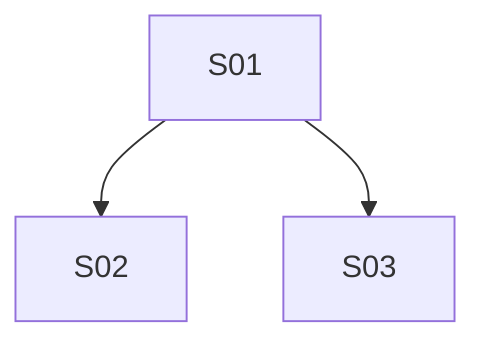

# Master backlog — [PROJECT_OR_FEATURE_NAME]

Macro backlog for **[PROJECT_OR_FEATURE_NAME]**.

This file is a **strategic index + consolidated state**. It organizes phases, sprints, dependencies, priority, and the next executable sprint. The living detail of each sprint lives in `SPRINT_S<NN>_<slug>.md` (product contract §7); the PLAN is born later, sliced by sprint + real code.

Use this template to transform conversation, ideas, briefings, roadmaps, or macro spec/PRD-ish into a lean, traceable sequence executable by Talos.

---

## 1. Document contract

### 1.1 Role of each artifact

| Artifact | Role | Must not contain |
|---|---|---|
| Master backlog | Macro strategy, sprint index, state, and dependencies | Complete acceptance criteria, technical plan, execution logs |
| Sprint file | Living sprint scope, contract §7 (what/why/acceptance), DoR/DoD, risks, gates, links, `eval_manifest` | Detailed task-by-task implementation |
| Sprint PLAN | Technical execution, tasks, invariants, local validation | Macro roadmap, duplicated product decisions |
| State file | Factual evidence of execution/validation | New planning or retrospective justification |

### 1.2 Precedence in conflict

1. Approved formal decisions: [link/file]
2. External contracts/backend/specs: [link/file]
3. Contract §7 of current sprint file (approved + seal): [link/file]
4. Current sprint file (other sections): [link/file]
5. This master backlog
6. Exploratory notes/drafts: [link/file]

Notes:

- Backlog does not create business rules alone.
- Sprint file (contract §7) is the bridge between macro and PLAN.
- Approved+sealed contract §7 supersedes other sections of sprint in product/acceptance.
- Approved PLAN supersedes sprint file in technical execution.
- Any relevant divergence must become a recorded decision or blocker.

---

## 2. Metadata

| Field | Value |
|---|---|
| Product / feature | [name] |
| Status | [draft / active / paused / completed / archived] |
| Owner | [role/name] |
| Created at | [YYYY-MM-DD] |
| Last updated | [YYYY-MM-DD] |
| Macro source | [conversation / briefing / roadmap / macro PRD / issue / doc] |
| Recommended sprint directory | `.talos/backlog/sprints/` |
| Next executable sprint | [SNN or `none`] |

---

## 3. Macro goal

**Expected final result:** [product/operational result in one sentence]

### Expected results

- [ ] [macro result 1]
- [ ] [macro result 2]
- [ ] [macro result 3]

### Outside current cycle

- [ ] [macro out-of-scope 1]
- [ ] [macro out-of-scope 2]
- [ ] [macro out-of-scope 3]

---

## 4. Decomposition principles

1. Macro stays in backlog; execution stays in sprint.
2. Each sprint has a single, small, and testable goal.
3. A large sprint must be broken down before PLAN.
4. Blocking dependency must have an owner, status, and action.
5. `Must` without ready dependency does not skip queue due to verbal urgency.
6. Contract §7 only closes in sliced sprint file/`sprint` (`backlog-item` is legacy alias).
7. PLAN is only born from approved+sealed contract §7 + reading real code.
8. Evidence beats narrative: important claims must point to artifact, gate, or state.
9. Learnings between sprints go into sprint file/backlog, not loose memory.
10. Closed decisions are not reopened without historical record.

---

## 5. States and gates

### 5.1 Sprint states

`backlog → ready → doing → review → manual_validation_pending → done`

Side states: `blocked`; parking for `--loop`: `detached_repair` (entry via `doing`/`review`; exit via `ready`/`blocked`).

| State | Meaning | Contract §7 ready? | Can execute? |
|---|---|---:|---:|
| backlog | Identified, no green DoR yet | no | no |
| ready | Green DoR and dependencies satisfied | yes (approved+seal) | after §7/PLAN according to mode |
| doing | In execution | do not reopen §7 without decision | yes |
| review | Implemented, awaiting validation/review | no | do not mutate outside repair |
| manual_validation_pending | Automated proofs green, awaiting manual validation (`M`); satisfies DEP, does not emit handoff | yes (approved+seal) | no |
| done | Green DoD and evidence recorded | no | no |
| blocked | Blocked by decision/dependency | no | no |
| detached_repair | Parked: unrecoverable P0/P1 residual in loop `--loop`; does not satisfy DEP; does not emit handoff | yes (approved+seal) | no |

### 5.2 Global Definition of Ready

- [ ] Sprint file exists and is linked in backlog.
- [ ] Single goal.
- [ ] Previous dependencies `done`/`manual_validation_pending` or explicitly non-blocking.
- [ ] Critical blockers resolved or with logged decision.
- [ ] In-scope / out-of-scope clear.
- [ ] Minimal `eval_manifest` defined in sprint file.
- [ ] Explicit deterministic next action recorded.

### 5.3 Global Definition of Done

- [ ] Contract §7 approved + seal, when applicable.
- [ ] PLAN executed, when applicable.
- [ ] Cold validator completed.
- [ ] Evidence/state linked in sprint file.
- [ ] Sprint file and backlog status synchronized.
- [ ] Relevant learnings/decisions recorded.

---

## 6. Decisions and blockers

### Blocking decisions

Use this table for decisions that prevent one or more sprints from becoming `ready`. Every decision declares provenance in the `Origin` column (v0.16.0).

| ID | Decision | Blocks | Owner | Origin | Status |
|---|---|---|---|---|---|
| D1 | [decision given by user] | [SNN/DEP] | [person/team] | user | [pending/decided] |
| D2 | [decision read from real code/contract] | [SNN/DEP] | [person/team] | derived:packages/example.js | [pending/decided] |
| D3 | [decision inferred by model] | [SNN/DEP] | [person/team] | assumption | [pending/decided] |

Provenance `Origin` legend (enum): `user` — interview response or direct brainstorm quote; `derived:<path>` — read from real code/contract, path relative to repo root, suffix ` (new)` when file will be created; `assumption` — inferred by model.

### External dependencies

| ID | Dependency | Blocks | Owner | Status | Action |
|---|---|---|---|---|---|
| DEP-001 | [contract/API/access/decision] | SNN | [owner] | [open/done/blocked] | [action] |

---

## 7. Sprint registry

One line per sprint. Living detail in file pointed to in **Sprint file**.

The first 12 columns preserve compatibility with current Talos helpers. New columns enter at the end — `Revalidation` (index 15, flag) is the last.

| ID | Sprint | Source-phase | Goal (1 line) | MoSCoW | Gain | Effort | Priority | PRD | Depends on | State | Gate | Sprint file | PLAN | State | Revalidation |
|---|---|---|---|---|---|---|---|---|---|---|---|---|---|---|---|
| S01 | [name] | F0 | [short goal] | Must | High | Low | P0 | pending | — | backlog | — | `.talos/backlog/sprints/SPRINT_S01_[slug].md` | pending | pending | — |
| S02 | [name] | F1 | [short goal] | Must | High | Medium | P0 | pending | S01 | backlog | — | `.talos/backlog/sprints/SPRINT_S02_[slug].md` | pending | pending | — |
| S03 | [name] | F1 | [short goal] | Should | Medium | Low | P1 | pending | S01 | backlog | — | `.talos/backlog/sprints/SPRINT_S03_[slug].md` | pending | pending | — |

Legend:

- **Source-phase:** `F0 discovery`, `F1 specification`, `F2 contract/infra`, `F3 implementation`, `F4 hardening`, `F5 release`.
- **MoSCoW:** `Must`, `Should`, `Could`, `Won't now`.
- **Gain/Effort:** `High`, `Medium`, `Low`.
- **Priority:** `P0`, `P1`, `P2`, `P3`.
- **Gate:** last relevant gate or `—`.
- **PRD:** legacy positional column (MCP compat) — use `pending` or `—`; acceptance lives in sprint §7.
- **Sprint file/PLAN/State:** living paths or `pending`.
- **Revalidation (flag, not status):** `true` when `M` failed in a sprint this depends on (transitive cone of `Depends on`); empty/`false` otherwise. Does not enter State enum, does not filter `select_next_sprint`, does not block `doing`/`review`; blocks `done` until affected `AC-*` are revalidated (D2/D10/D20).

---

## 8. Selection of next sprint

### 8.1 Deterministic rule

1. Filter sprints with satisfied dependencies.
2. Filter sprints with existing sprint file.
3. Filter sprints with green global DoR.
4. Sort by MoSCoW: `Must` → `Should` → `Could`.
5. Within the same class, prioritize higher gain and lower effort.
6. On tie, pick the one reducing highest risk or unblocking more sprints.
7. Record decision in `8.2`.

### 8.2 Next executable sprint

| Field | Value |
|---|---|
| Selected sprint | [SNN] |
| Reason | [why this sprint wins by rules above] |
| Dependencies satisfied | [yes/no + summary] |
| Sprint file | [path] |
| Next action | [mature §7 / update sprint file / resolve blocker / execute PLAN] |

---

## 9. Dependency graph

### 9.1 Graph

## 10. Macro decisions

Decisions changing sequence, macro scope, priority, or contract between sprints.

| ID | Decision | Impact | Date | Status |
|---|---|---|---|---|
| DEC-001 | [decision] | [affected sprints] | [YYYY-MM-DD] | [proposed/approved/reverted] |

---

## 11. Macro risks

| ID | Risk | Affects | Prob. | Impact | Mitigation | Status |
|---|---|---|---|---|---|---|
| R-001 | [risk] | [SNN/phase] | [low/medium/high] | [low/medium/high] | [mitigation] | [open/monitored/closed] |

---

## 12. Progress

| Phase | Sprints | Done | Doing/Review | Blocked | Remaining |
|---|---:|---:|---:|---:|---:|
| F0 discovery | [n] | [n] | [n] | [n] | [n] |
| F1 specification | [n] | [n] | [n] | [n] | [n] |
| F2 contract/infra | [n] | [n] | [n] | [n] | [n] |
| F3 implementation | [n] | [n] | [n] | [n] | [n] |
| F4 hardening | [n] | [n] | [n] | [n] | [n] |
| F5 release | [n] | [n] | [n] | [n] | [n] |

---

## 13. Update protocol

Update this backlog when:

- a new sprint is created, broken down, blocked, or completed;
- priority/dependency changes;
- PLAN/state is born or changes path;
- sprint file changes status or seals contract §7;
- macro decision changes sequence.

Do not update this backlog to:

- list technical tasks from PLAN;
- copy full criteria from contract §7;
- record detailed execution logs;
- store findings belonging only to a single sprint.

---

## 14. Anti-drift contracts

- Sprint IDs are immutable once published.
- Sprint `done` does not change scope without new sprint or explicit historical record.
- Backlog and sprint file status must match.
- Every `Depends on` references existing sprint or `DEP-*`.
- Every listed PLAN must exist or be marked as `pending`.
- Column `PRD` in registry is **positional legacy** (MCP helper compat): keep `pending` or `—`; do not generate PRD.
- Every `ready` sprint must have a linked sprint file.
- Macro input does not jump straight to plan; first becomes backlog + sprint file (contract §7).

---

## 15. History

| Date | Author | Change |
|---|---|---|
| [YYYY-MM-DD] | [name/agent] | Master backlog creation |
